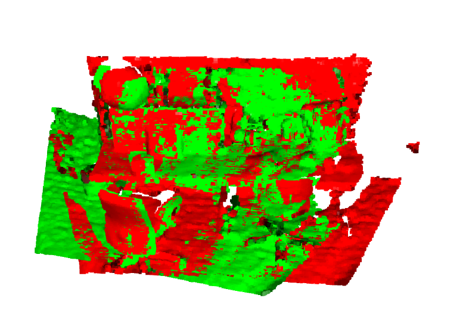
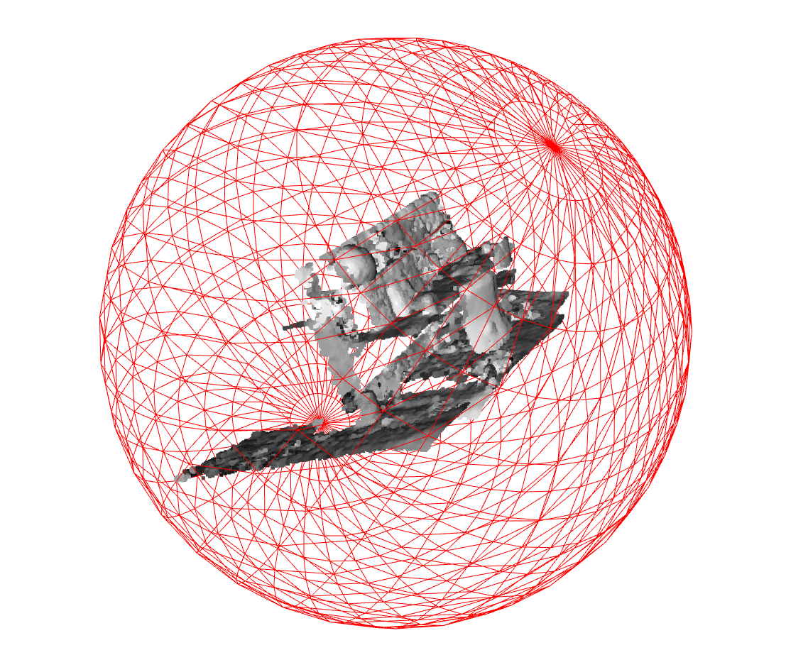

# Trabalho Prático – SAVI
# Eduardo Pereira - 108009
# Gonçalo Almeida - 108432 
## Registo de Nuvens de Pontos RGB-D com ICP

Este projeto teve como objetivo trabalhar com registo de nuvens de pontos RGB-D usando o algoritmo ICP, tanto através das ferramentas já prontas do Open3D como através de uma implementação personalizada construída por nós. Na ultima tarefa, o objetivo foi otimizar os parametros de uma esfera de forma a que ele inclua todos os pontos de duas pointclouds, de forma a que tenha o menor raio possivel. O dataset usado foi o TUM fornecido pelo professor nas aulas praticas, contendo pares RGB + profundidade, a partir dos quais gerámos as respetivas point clouds.

---

# Pré-processamento

Antes de aplicarmos o ICP, tratámos todos os pares RGB-D da mesma forma. Começámos por carregar as imagens com o OpenCV, garantindo que a profundidade se mantinha em `uint16`. Convertêmo-las para objetos do Open3D e criámos imagens RGBD usando os **parâmetros intrínsecos** do dataset TUM (focais **$fx, fy = 525.0$** e escala de profundidade **$5000.0$**). A partir daí, gerámos as nuvens de pontos (`PointCloud`) com a função `o3d.geometry.PointCloud.create_from_rgbd_image`, mantendo as cores originais. Como o Open3D usa um sistema de coordenadas diferente, aplicámos de seguida uma **transformação de correção** (`pcd.transform`) para alinhar a orientação das nuvens de pontos. Finalmente, fizemos **voxel downsampling** (`voxel_down_sample`) com um tamanho de voxel de **0.02** metros para reduzir a densidade e acelerar o processamento, e calculámos os vetores **normais** (`estimate_normals`) para as puder usar no método Point-to-Plane do ICP.

---

# Tarefa 1 – ICP com Open3D

Nesta tarefa utilizámos diretamente o ICP do Open3D. Isto serviu como referência para comparar depois com a implementação personalizada. Para o alinhamento, definimos o método de estimação como **Point-to-Plane** (`TransformationEstimationPointToPlane`), que é mais eficiente, e impusemos uma **distância máxima de correspondência** (*threshold*) de **0.15 metros** para filtrar correspondencias incorretas. A otimização começou com uma **transformação inicial de identidade**. 

### Visualização  

**Antes do ICP:**  
> 

**Depois do ICP:**  
> 

O resultado final devolvido no objeto `icp_result` foi bastante bom e as nuvens convergiram corretamente.

---

# Tarefa 2 – ICP Personalizado (SciPy)

Aqui construímos o ciclo ICP completo manualmente. Isto incluiu: encontrar correspondências, calcular a função de erro, usar o `least_squares` do SciPy para obter incrementos de transformação e aplicar esses incrementos iterativamente.

Em cada iteração, o processo seguiu os seguintes passos:

1.  **Associação de Correspondências (`corresp`):** Utilizámos uma **KD-Tree** (`open3d.geometry.KDTreeFlann`) construída a partir da nuvem de pontos *alvo* (`pcl_target`) para encontrar o vizinho mais próximo para cada ponto da nuvem *fonte* transformada. Aplicámos um `threshold` de distância máxima para filtrar correspondências inválidas.
2.  **Função de Custo (`Erro`):** Esta função recebe o vetor de 6 parâmetros de transformação incremental ($\Delta T$ - 3 translações e 3 rotações de Euler), os pontos da fonte e os pontos alvo correspondentes.
    * **Transformação Incremental:** A função `vetor_matriz` converte o vetor de 6 elementos numa matriz de transformação $4\times4$.
    * **Cálculo do Resíduo:** O vetor de transformação é aplicado à fonte, e o **erro (residual)** é calculado como a diferença euclidiana entre os pontos da fonte transformados e os seus correspondentes no alvo. O resultado é devolvido como um array 1D de distâncias individuais (`distancias_ind.flatten()`).
3.  **Otimização (`least_squares`):** Pedimos ao `scipy.optimize.least_squares` (método Levenberg-Marquardt, `'lm'`) para minimizar o resíduo calculado pela função `Erro`. O resultado desta otimização é a transformação *incremental* ($\Delta T$) que melhor alinha as correspondências atuais.
4.  **Aplicação da Transformação:** A transformação incremental é aplicada à nuvem de pontos *fonte* e acumulada na matriz de transformação total (`transformacao_iterativa = T_incremental @ transformacao_iterativa`).
5.  **Critério de Paragem:** O ciclo termina quando o tamanho do incremento de transformação (`alteracao`) é menor que um limite pré-definido ($\mathbf{1e-3}$) ou quando o número máximo de iterações é atingido.

O maior desafio desta tarefa foi perceber como usar corretamente o `scipy.optimize.least_squares` dentro do ciclo ICP. No início não sabíamos muito bem como montar a função de erro corretamente, nem como passar os pontos correspondentes ao otimizador. Para complicar, também não estava claro como aplicar a transformação devolvida pelo `least_squares` de forma incremental ao longo das iterações.

### Visualizações  

**Antes do ICP personalizado:**  
> 

**Depois do ICP personalizado:**  
> 

### Saída do terminal  
> 

O resultado final ficou bastante próximo do obtido com o ICP do Open3D, o que confirmou que a nossa implementação estava correta e funcional.

---

# Comparação entre as duas abordagens

O ICP do Open3D foi claramente mais rápido, já que é bastante otimizado. A nossa versão personalizada foi muito útil para compreender em detalhe o funcionamento interno do algoritmo. Embora precise de mais afinações para ser tão estável quanto a versão do Open3D, produziu resultados bastante semelhantes.

---

# Tarefa 3 – Otimização da Esfera Englobante Mínima

Nesta tarefa pretendemos construir um esfera capaz de abranger todos os pontos de ambas as poinntclouds inseridas (depois de uma delas sofrer uma transformação gerada pelo icp costumizado da Tarefa 2). 

Para fazer esta otimização, tivemos primeiro que aplicar a transformação obtida à pointcloud_fonte, de maneira a que esta ficasse o mais sobreposta possível com a pointcloud_target. Depois de organizarmos os pontos de ambas as pointclouds em arrays distintos, criámos o array combined_points, que seria a incorporação de todos os pontos de ambas as pointclouds num único array. 
Para ser feita a otimização, precisávamos de palpites iniciais do vetor da esfera (raio e coordenadas do centro). Para isso, encontrámos as coordenadas máxima e mínima do array combined_points, conseguindo assim, dividindo a soma destas duas coordenadas por 2, obter um bom palpite inicial para as coordenadas do centro da esfera. Posteriormente, através da função np.linalg.norm, através da avaliação de todos os pontos do combined_points, fomos encontrar a distância euclidiana do ponto mais afastado. Este valor foi usado como palpite inicial para o raio da esfera.

Posto isto, temos já todos os parâmetros iniciais necessários para proceder à otimização. 
Para isso, definimos a função erro que permitiu diferenciar os pontos que estavam dentro e fora de uma esfera gerada inicialmente (palpites iniciais), retornando um array 1D com o valor do raio da esfera na primeira posição, seguida de valores 0 ou diferentes de 0, consoante o ponto estivesse dentro ou fora da esfera, respetivamente. Esta distinção foi feita através de, primeiramente, do cálculo da distância euclidiana do ponto ao centro da esfera, e, posteriormente, da subtração desta distância com o valor do raio da esfera, na respetiva iteração, para todos os pontos. Se a distância calculada fosse maior que o raio, então o ponto estaria fora da esfera. 
De salientar também que, dentro da função erro desenvolvida, no momento em que é determinado se o ponto está dentro ou fora da esfera, foi multiplicada uma constante PENALTY ao valor returnado (0 ou diferente de zero), de maneira a que os pontos que não estivessem dentro da esfera sofressem uma grande penalização, para assim não serem ignorados pelo programa e puderem ser imediatamente otimizados na respetiva iteração.

                                                                          PENALTY = 1e6

Através da função least_squares foi possível optimizar este array, de maneira a conseguir que o programa minimizasse tanto os valores das distâncias dos pontos ao centro da esfera, como o próprio raio da esfera, caso estes valores das distâncias fossem todos 0. A esfera final, que engloba todos os pontos de ambas as pointclouds, foi gerada com os resultados do vetor esfera final (variável a otimizar), considerando:

                                                 vetor_esfera_final = xc_final, yc_final, zc_final, r_final

Nesta tarefa consideramos que o maior desafio acabou por ser a caracterização da própria esfera circundante, de maneira a conseguir vizualizar tanto a esfera como as pointclouds no seu interior.
Por curiosidade, foi testado também se o programa alargaria/adaptaria a esfera desenvolvida para valores diferentes da transformação (considerando uma transformação que afastasse as duas pointclouds), o que também se verificou.
 
**Visualização:**  
> 

# Conclusão

Este trabalho permitiu-nos entender melhor como gerar point clouds RGB-D, como trabalhar com o sistema de coordenadas do Open3D, e sobretudo como funciona o ICP tanto numa versão pronta como na construção manual.

No final ficámos com uma boa perceção da diferença entre usar uma biblioteca altamente otimizada e implementar o ciclo completo por conta própria, o que foi bastante enriquecedor para a compreensão do processo.

---

